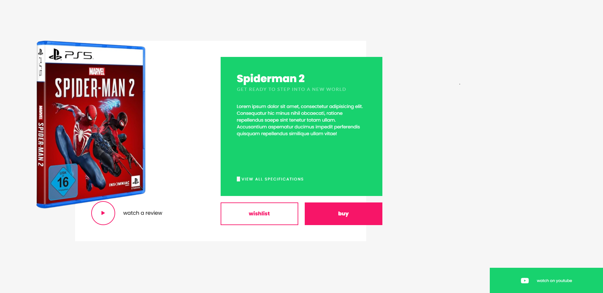

# 🚀 Kiumars Animated Reveal  

A **creative HTML & CSS animation project** showcasing a stylish **3D cube reveal effect**.  
This project demonstrates the power of **pure CSS animations** and smooth UI transitions without using JavaScript.  

🌐 **Live Demo:** [View on GitHub Pages](https://kiumars609.github.io/kiumars-animated-reveal/)  

---

## ✨ Features  
- 🎨 Pure **HTML & CSS** only – no JavaScript  
- 📦 Animated **3D cube reveal effect**  
- ⚡ Smooth transitions and modern UI design  
- 🔥 Lightweight & responsive layout  
- 💡 Easy to customize and extend  

---

## 📸 Preview  
  

---

## 🛠️ How to Use  
1. Clone this repository:  
   ```bash
   git clone https://github.com/Kiumars609/kiumars-animated-reveal.git
